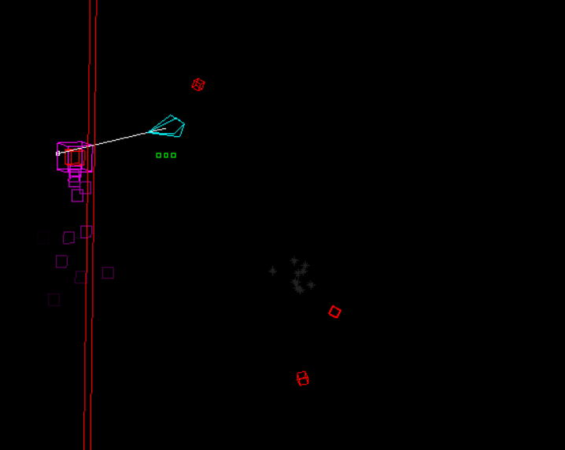

# Ubisoft NEXT 2024 Programming Entry

  

This repository contains both the engine and game components made for Ubisoft NEXT 2024. The rendering is built on top of Ubisoft NEXT's API, which contains a screen-space line renderer.
A video demo for the game can be found [here](https://youtu.be/Cig_ovB-aKU)

## How to play?

To run the game, there is a .exe in <code>x64/Debug/Game.exe</code> or alternatively, the project can be loaded in Visual Studio 2022 and compiled there.

## Engine Features
- Math backbone built from the ground up, featuring Matrices, Vectors, Matrix transformations, and convenient operator overloads between types
- 3D Renderer built ontop of Ubisoft NEXT API's 2D line renderer, doing 3D math from scratch to get world space coordinates to screen space.
- Object pooling on frequent entities with data locality
- Entity Component System'
- Unit tests
